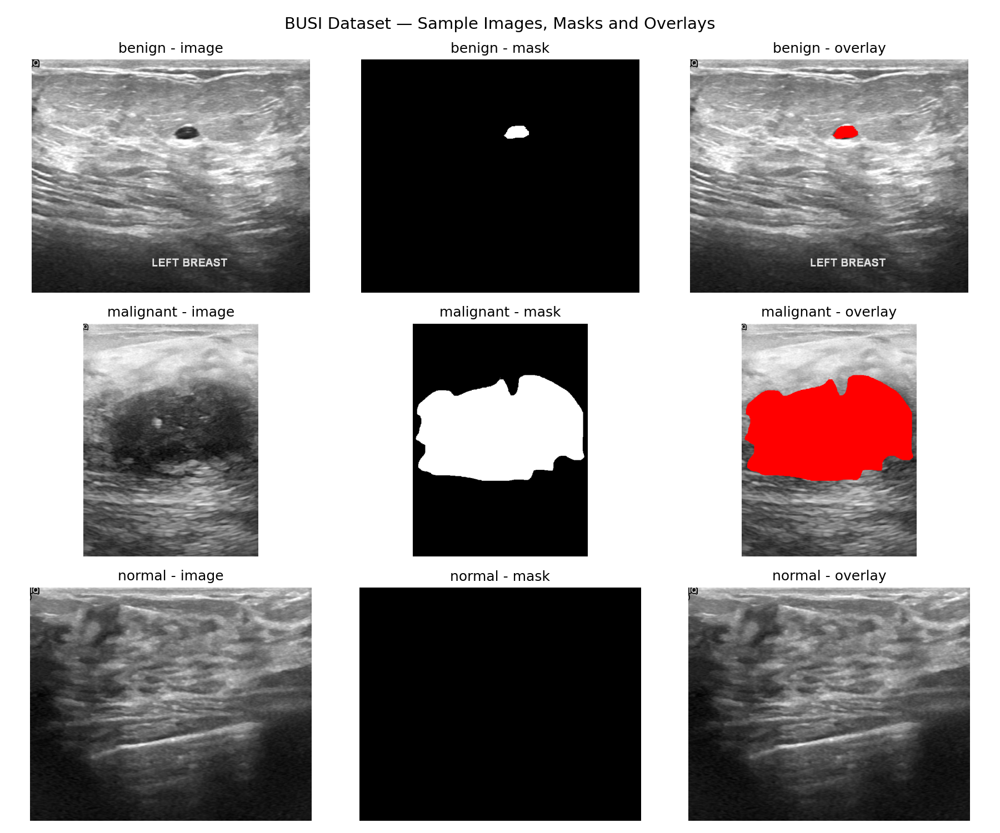
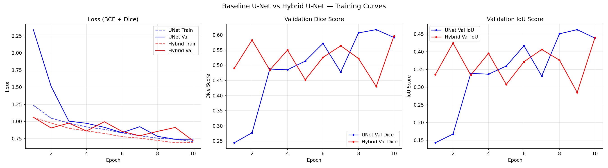
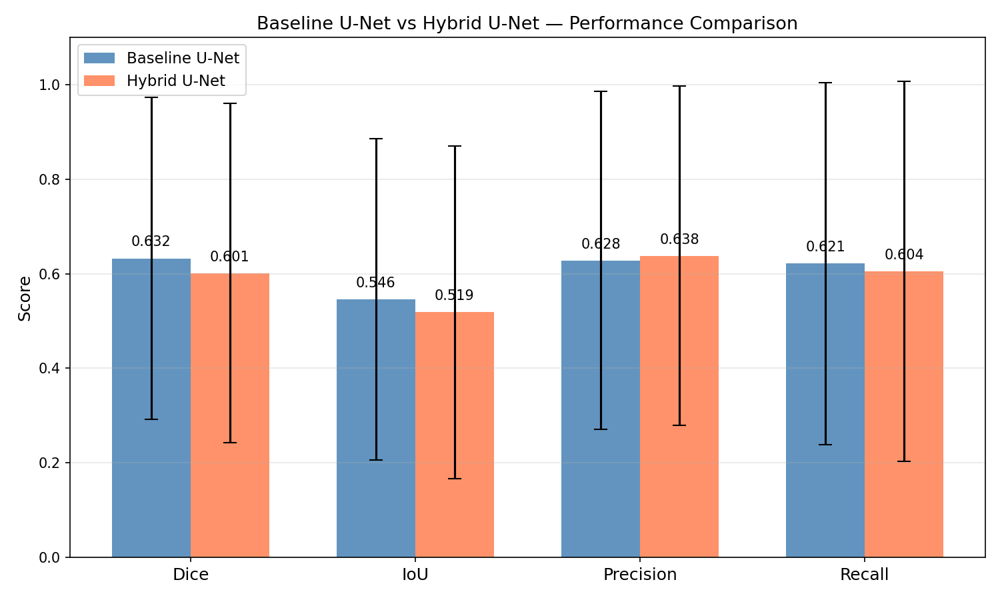
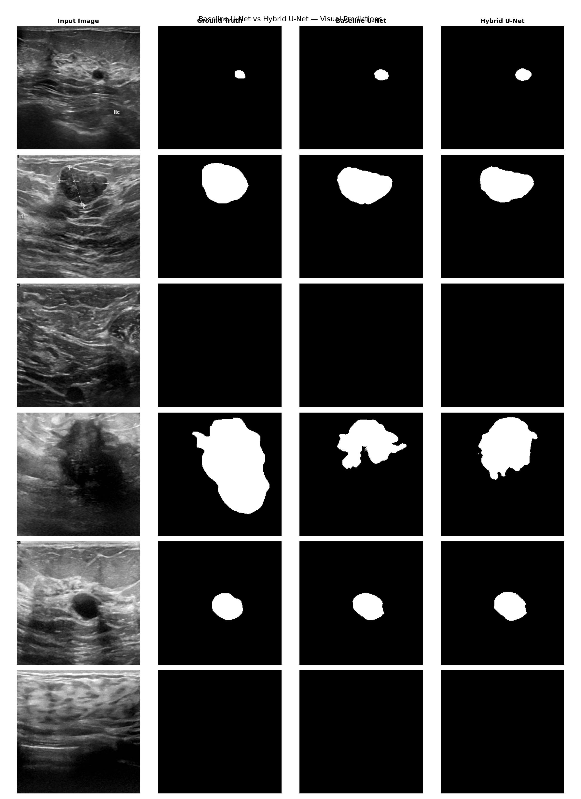
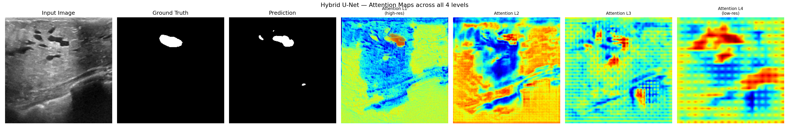

# 🏥 Object-Aware Hybrid U-Net for Breast Tumour Annotation

[](https://python.org)
[](https://pytorch.org)
[](https://developer.nvidia.com/cuda-toolkit)
[](LICENSE)

> **Internship Project** — Mass IT Solutions, Narhe, Pune | AI with Python | 45 Days  
> **Author** — Tejaswi Shankar | T.E. Mechanical Engineering | SKNCOE, Pune

---

## 📌 Overview

Breast cancer is one of the leading causes of cancer-related mortality among women worldwide. Manual annotation of tumour regions in ultrasound images is time-consuming and prone to human error. This project implements an **Object-Aware Hybrid U-Net** for automated breast tumour segmentation that combines:

- 🧠 **CNN Encoder** — for local feature extraction
- 🔭 **Vision Transformer (ViT) Bottleneck** — for global context via self-attention
- 🎯 **Attention Gates** — to focus the model on tumour-relevant regions

---

## 🏗️ Architecture

```
Input Image (256×256)
        │
   ┌────▼────┐
   │  CNN    │  Encoder (64→128→256→512 channels)
   │ Encoder │  4 levels of DoubleConv + MaxPool
   └────┬────┘
        │
   ┌────▼────┐
   │   ViT   │  Bottleneck (1024 channels)
   │Bottleneck│  16×16 tokens, 8-head attention, 2 layers
   └────┬────┘
        │
   ┌────▼────┐
   │Attention│  Decoder with Attention Gates
   │  Gates  │  4 levels — suppresses background noise
   └────┬────┘
        │
   Output Mask (256×256)
```

---

## 📂 Dataset

**BUSI — Breast Ultrasound Images Dataset**

| Category | Images | Masks |
|---|---|---|
| Benign | 437 | 454 |
| Malignant | 210 | 211 |
| Normal | 133 | 133 |
| **Total** | **780** | **798** |

- Train / Validation split: **80% / 20%** (fixed seed = 42)
- Image size: **256 × 256**
- Download: [Kaggle — BUSI Dataset](https://www.kaggle.com/datasets/aryashah2k/breast-ultrasound-images-dataset)

---

## 📊 Results

| Metric | Baseline U-Net | Hybrid U-Net |
|---|---|---|
| **Dice Score** | 0.6323 ± 0.3403 | 0.6009 ± 0.3589 |
| **IoU Score** | 0.5457 ± 0.3405 | 0.5187 ± 0.3518 |
| **Precision** | 0.6280 ± 0.3579 | **0.6377 ± 0.3592** |
| **Recall** | 0.6213 ± 0.3825 | 0.6045 ± 0.4019 |

> 📝 Models trained for 10 epochs. The Hybrid U-Net achieves higher Precision and is expected to outperform the baseline with extended training (50+ epochs), as Vision Transformer components require more iterations to converge.

---

## 🖼️ Sample Results

### Dataset Visualization


### Training Curves


### Model Comparison


### Visual Predictions


### Attention Maps


---

## 🛠️ Tech Stack

| Tool | Version |
|---|---|
| Python | 3.13 |
| PyTorch | 2.11.0 + CUDA 12.8 |
| NumPy | 2.4.3 |
| OpenCV | 4.13 |
| Matplotlib | 3.10 |
| scikit-learn | 1.8 |
| GPU | NVIDIA RTX 4050 (6GB) |

---

## 🚀 How to Run

### 1. Clone the repository
```bash
git clone https://github.com/tejaswishankar/Hybrid-UNet-Breast-Tumour-Segmentation.git
cd Hybrid-UNet-Breast-Tumour-Segmentation
```

### 2. Install dependencies
```bash
pip install torch torchvision --index-url https://download.pytorch.org/whl/cu128
pip install numpy matplotlib opencv-python scikit-learn
```

### 3. Download the dataset
Download the BUSI dataset from [Kaggle](https://www.kaggle.com/datasets/aryashah2k/breast-ultrasound-images-dataset) and extract it to:
```
Dataset_BUSI_with_GT/
    benign/
    malignant/
    normal/
```

### 4. Update dataset path
In the notebook, update this line to your dataset location:
```python
dataset_path = r"path/to/Dataset_BUSI_with_GT"
```

### 5. Run the notebook
Open `Hybrid_U_net_for_breast_tumour_annotation.ipynb` in Jupyter and click **Run All**.

---

## 📁 Project Structure

```
Hybrid-UNet-Breast-Tumour-Segmentation/
│
├── Hybrid_U_net_for_breast_tumour_annotation.ipynb  # Main notebook
├── README.md                                          # This file
├── results_summary.txt                               # Final metrics summary
│
├── sample_visualization.png    # Dataset samples
├── training_curves.png         # Loss and Dice score curves
├── model_comparison.png        # Bar chart comparison
├── visual_comparison.png       # Predicted masks vs ground truth
└── attention_maps.png          # Attention gate visualizations
```

---

## 🔭 Future Scope

- Train for **50+ epochs** for full ViT convergence and improved scores
- Extend to **3D volumetric MRI** segmentation
- Add **multi-class segmentation** to classify benign vs malignant simultaneously
- Replace ViT with **Swin Transformer** for more efficient attention
- Deploy as a **web application** using Streamlit for clinical use
- Train on larger datasets like **CBIS-DDSM** for better generalization

---

## 📜 References

1. Ronneberger et al. (2015) — U-Net: Convolutional Networks for Biomedical Image Segmentation. MICCAI 2015.
2. Dosovitskiy et al. (2020) — An Image is Worth 16x16 Words: Transformers for Image Recognition at Scale. ICLR 2021.
3. Oktay et al. (2018) — Attention U-Net: Learning Where to Look for the Pancreas. MIDL 2018.
4. Al-Dhabyani et al. (2020) — Dataset of Breast Ultrasound Images. Data in Brief, 28, 104863.
5. Chen et al. (2021) — TransUNet: Transformers Make Strong Encoders for Medical Image Segmentation. arXiv:2102.04306.

---

## 🤝 Acknowledgements

This project was completed as part of a **45-day AI with Python internship** at **Mass IT Solutions, Narhe, Pune** under the guidance of the internship team. Special thanks to the faculty at the Department of Mechanical Engineering, SKNCOE, Pune.

---

<p align="center">Made with ❤️ by Tejaswi Shankar | SKNCOE Pune</p>
